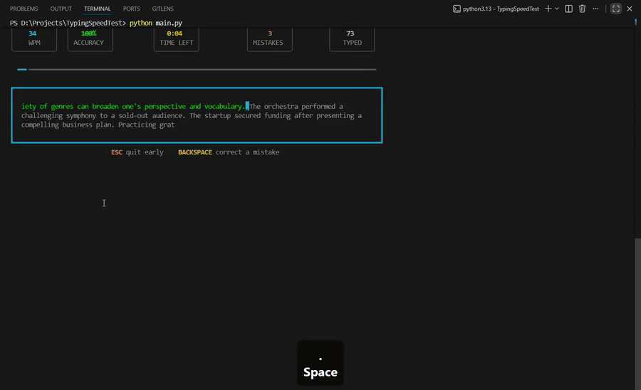
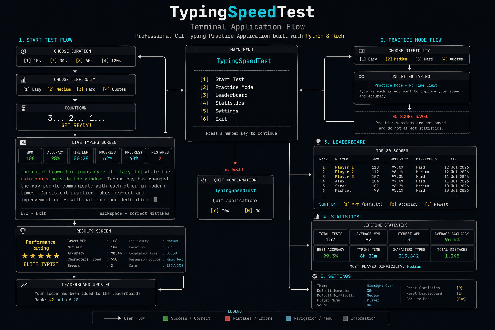

# TypingSpeedTest

A modern terminal-based typing speed practice application built with **Python** and **Rich**.

Inspired by Monkeytype, TypingSpeedTest brings a clean, responsive typing experience to the terminal with real-time performance metrics, persistent statistics, customizable settings, and a modular architecture.

<p align="left">
    
    
    
    
</p>

---

## Demo

<p align="center">
    
</p>

A short demonstration of the application's interface and typing experience.

---

## Application Overview

<p align="center">
    
</p>

The infographic above shows the complete application flow, including the main menu, typing session, practice mode, leaderboard, statistics, settings, and overall navigation.

---

## Features

- Real-time WPM and Accuracy tracking
- Live typing feedback with Rich
- Multiple difficulty levels
  - Easy
  - Medium
  - Hard
  - Random Quotes
- Practice Mode
- Persistent Leaderboard
- Lifetime Statistics
- Multiple UI Themes
- Configurable Test Duration
- Cross-platform Keyboard Support
- Local JSON Data Storage

---

## Installation

Clone the repository

```bash
git clone https://github.com/Pranav-Teja-Aluvala/Typing-Speed-Test.git
```

Move into the project

```bash
cd Typing-Speed-Test
```

Install dependencies

```bash
pip install -r requirements.txt
```

Run the application

```bash
python main.py
```

---

## Project Structure

```text
Typing-Speed-Test/
│
├── assets/            # Typing passages
├── data/              # Leaderboard, statistics and settings
├── demo/              # Demo GIF and video
├── screenshots/       # Project images
├── src/               # Source code
│
├── main.py
├── requirements.txt
├── README.md
└── LICENSE
```

---

## Tech Stack

| Technology | Purpose |
|------------|---------|
| Python | Core application |
| Rich | Terminal UI |
| JSON | Persistent storage |
| Dataclasses | Structured models |
| pathlib | File management |

---

## Repository Highlights

- Modular architecture
- Separation of UI and business logic
- Persistent local storage
- Cross-platform support
- Easy to extend and maintain

---

## Contributing

Contributions, suggestions, and improvements are welcome.

If you'd like to improve the project, feel free to fork the repository and open a Pull Request.

---

## License

This project is licensed under the MIT License.
